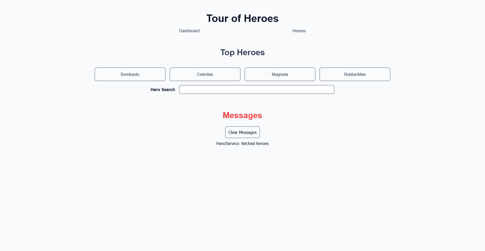
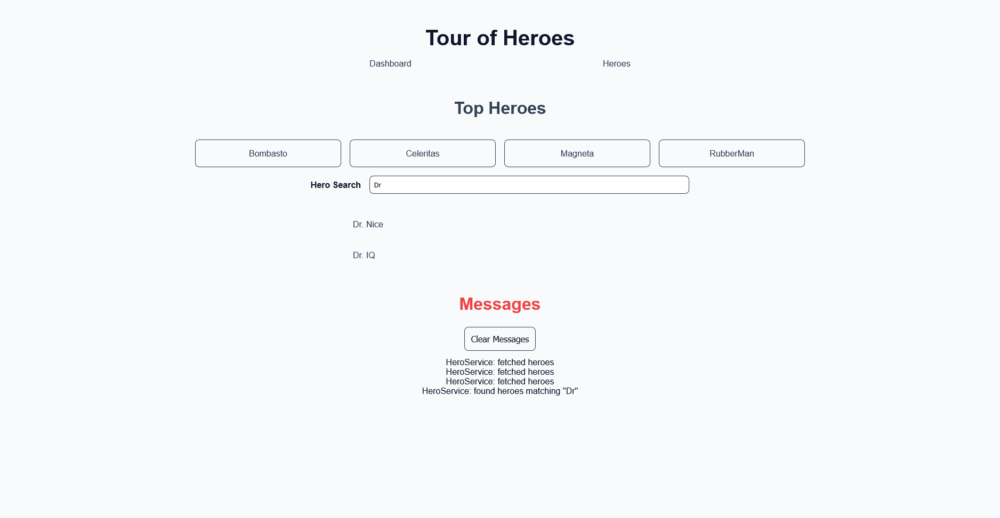
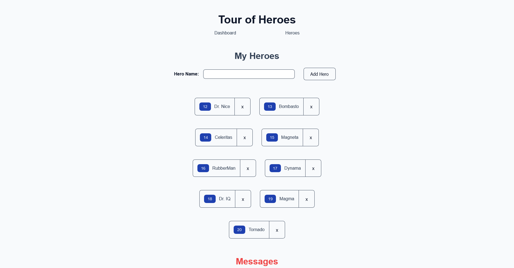
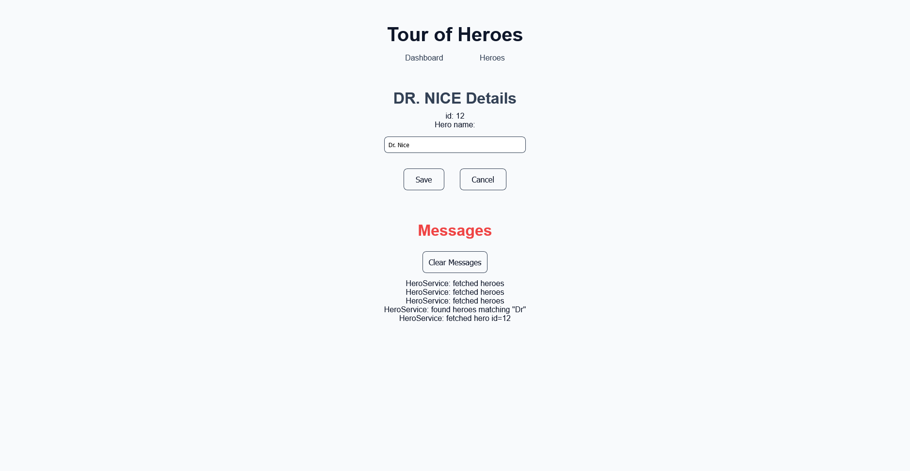
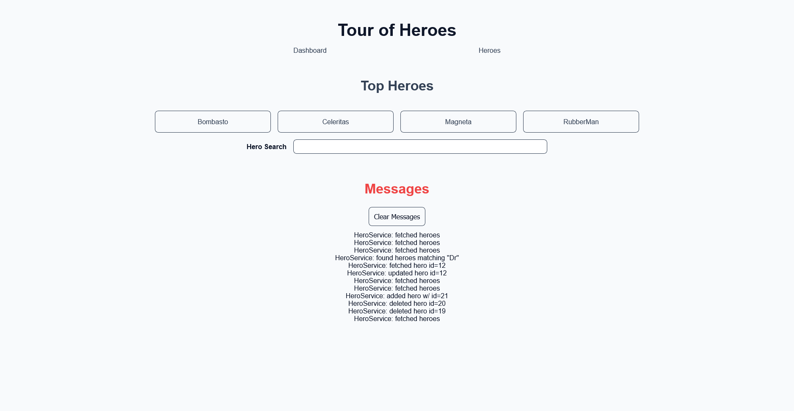

	
	<h1>Tour of Heroes</h1>

Welcome to the **Tour of Heroes** App!

This is an Angular application designed to demonstrate some key Angular concepts. Built using the Angular tutorial documentation.

It allows users to manage and view their heroes. It uses an in-memory web API to perform CRUD operations on the application data.

## Features

- **Navigation**:
	- Defines routes to the Dashboard page and the Heroes page.
- **Dashboard**: 
	- Shows a subset of the Heroes as 'Top Heroes'. Clicking on one of these will open the detail page for that Hero.
	- Hero Search allows the user to type and a list of matches will be returned. Clicking on one of these will open the detail page for that Hero.
- **Heroes**:
	- Allows the user to add a new Hero.
	- Displays a list of Heroes. Clicking on one of these will open the detail page for that Hero. Clicking the 'X' will delete that Hero.
- **Detail**:
	- Shows a Hero object. Allows the user to update the name.
- **Messages**:
	- Shows a list of messages that the application has performed. Allows the user to clear the list of messages.
- **Responsive Design**: 
	- A user-friendly interface designed to work on various devices.

## Technologies

- Angular
- HTML
- CSS

## Getting Started

### Prerequisites

- Angular v18.
- A code editor like Visual Studio or Visual Studio Code.
- Node.js
- NPM

### Installation

1. Clone the repository:
	- `git clone https://github.com/chrisjamiecarter/tour-of-heroes.git`

2. Navigate to the Web project directory:
	- `cd src\tourofheroes.web`

3. Install dependencies:
	- `npm install`

### Running the Application

1. Start the development server in the Web project directory:
	- `npm start`

## Usage

Once the Web application is running:

- View the Heroes Dashboard.
- Search for a Hero.
- View the list of Heroes.
- Add a new Hero.
- Edit a Hero.
- Delete a Hero.
- View the Messages.
- Clear the Messages.

### Dashboard

### Search

### Heroes

### Detail

### Messages

## How It Works

- **Page Display**: This project was generated with [Angular CLI](https://github.com/angular/angular-cli) version 18.2.6.
- **API Integration**: [angular-in-memory-web-api](https://github.com/angular/in-memory-web-api) is used to simulate calling an API.
- **Data Storage**: Storage is only persisted per browser session. A page refresh will reset the data.

## Contributing

Contributions are welcome! Please fork the repository and create a pull request with your changes. For major changes, please open an issue first to discuss what you would like to change.

## License

This project is licensed under the MIT License. See the [LICENSE](./LICENSE) file for details.

## Contact

For any questions or feedback, please open an issue.

---
***Happy Tour of Heroesing!***
